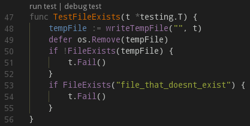

J'ai testé [VS Code](https://code.visualstudio.com/), l'éditeur de code Open
Source de Microsoft. J'étais extrêmement sceptique, n'ayant pas eu l'occasion
d'apprécier un outil Microsoft depuis fort longtemps.

<!--more-->

Et je dois dire que j'ai été conquis : en cinq minutes montre en main j'étais
opérationnel pour mes projets Golang. J'ai configuré le *GOPATH* en quelques
secondes et je n'ai pas eu à chercher longtemps pour lancer mes tests unitaires.

Ils ont fait les choses bien : pas de fichier de configuration binaire (dans
une base de registres :o) et une version pour Linux. Ils prennent en charge
nombre de formats de fichier (Golang, mais aussi Markdown). L'installation des
plugins est automatique et très rapide... Il y a même un raccourci dans le
source pour lancer les tests unitaires :

Mais surtout, il est très léger : mémoire et CPU sont très en dessous de ce que
demande un IntelliJ. Du coup mon petit portable perso
([un Chromebook sous Debian](http://sweetohm.net/article/debian-jessie-acer-c720p.html))
a retrouvé une seconde jeunesse !

J'ai désinstallé IntelliJ et je ne pense pas renouveler ma license l'année
prochaine. Mais au-delà de ces considérations pécuniaires, cela semble laisser
entendre que **Microsoft a peut être réellement changé**...

*Enjoy!*
