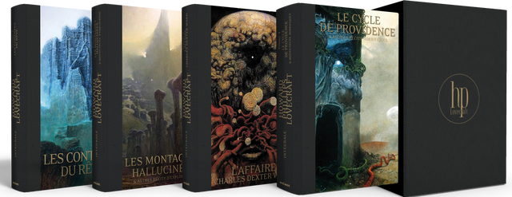

Je viens de découvrir un projet Ulule pour une
[intégrale Lovacraft prestige](https://fr.ulule.com/lovecraft-prestige/) et ma
carte bleue n'en est pas sortie indemne.

<!--more-->

Cette nouvelle édition bénéficiera d'une nouvelle traduction mais aussi de
magnifiques illustrations de couverture. La plupart des palliers ayant déjà été
débloqués, on peut s'attendre à une magnifique édition avec couverture
cartonnée, reliure tissus et garde-page.

Depuis quelques années déjà Bragelonne publie aussi de nouvelles traductions
des [œuvres de Lovecraft](http://www.bragelonne.fr/livres/view/cthulhu--le-mythe).
J'ai comparé cette nouvelle traduction avec celle de ma vieille édition Bouquins
et je dois dire qu'elle est bien meilleure.

Tolkien est aussi en train d'être traduit à nouveau. Cela voudrait-il dire que
ces auteurs autrefois *geeks* sont en train de devenir des classiques ou bien
est-ce le résultat des droits d'auteurs qui tombent dans le domaine public ?

En tout état de cause, je suis impatient de relire les œuvres du maître de
Providence dans une édition aussi belle, mais il va me falloir prendre mon mal
en patience car les ouvrages arriveront en août 2019...

*Enjoy!*
