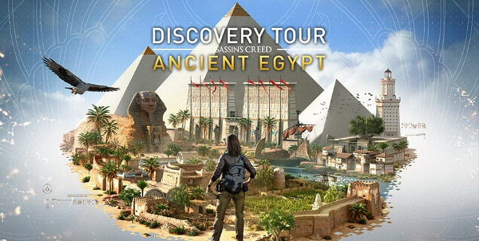

Ubisoft vient de publier un DLC pour Assassin's Creed Origins appelé Discovery
Tour. Il permet de se promener dans les décors du jeu, qui se passe en Egypte
antique à l'époque de César, sans combats ni intrigues.

<!--more-->

C'est un peu une machine à remonter le temps. D'autant plus qu'Ubisoft est
réputé pour porter un soin particulier pour recréer dans ses jeux Assassin's
Creed un décor et des personnages historiquement exacts.

Bien sûr ils prennent quelques libertés afin de rendre le jeu plus intéressant
et les décors ne sont pas toujours à l'échelle pour une question de jouabilité.
Par exemple, leur Egypte est bien plus petite qu'elle n'est en réalité, sinon
il faudrait des années pour parcourir l'aire de jeu, à pied et à cheval. Leur
Colisée était aussi plus petit dans leur Assassin's Creed Brotherhood, qui se
passait à Rome, afin que le personnage puisse l'escalader sans que cela
ralentisse le rithme du jeu.

Mon seul regret est qu'Ubisoft ait été frappé par le politiquement correct qui
leur a fait mettre des coquillages sur les parties génitales des statues...
C'est d'autant plus étrange pour une expérience qui se veut historique.

Malgré ces quelques défauts, c'est un rêve qui devient réalité : pouvoir
remonter le temps pour visiter les lieux emblématiques de l'antiquité.
L'expérience aurait été encore plus complète en VR, mais cela viendra peut
être dans un prochain DLC...

*Enjoy!*
