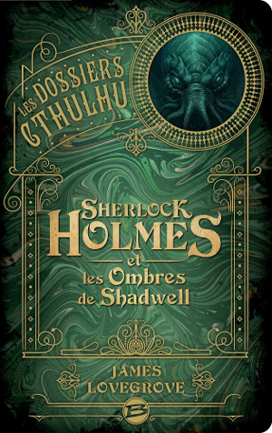

[Les Ombres de Shadwell](http://www.bragelonne.fr/livres/view/sherlock-holmes-et-les-ombres-de-shadwell) de James Lovegrove est un *cross over* entre Sherlock Holmes et Cthulhu.

<!--more-->

Le roman est bien amené et je ne vais pas vous gâcher le plaisir de découvrir cette pirouette de l'auteur dont le nom ressemble (un peu) à celui de Lovecraft...

Ce *cross over* fonctionne bien grâce à un style proche de celui de *Conan Doyle* et des personnages bien respectés. J'étais assez enthousiaste en commençant ce roman et je n'ai pas été déçu.

D'autre part, le livre en lui-même est un très bel objet, avec des dorures sur la couverture et la tranche, ce qui ne gâche rien. On le trouve aussi en [dématérialisé sans DRM](https://www.7switch.com/fr/ebook/9791028103965/sherlock-holmes-et-les-ombres-de-shadwell).

Pour les joueurs du jeu de rôle *L'Appel de Cthulhu*, cela ferait un excellent scénario pour *Cthulhu 1890*.

*Enjoy!*
