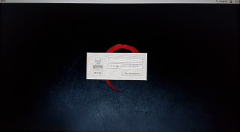

L'image de fond affichée au boot de Linux est souvent horrible, mais il est possible de la changer simplement.

<!--more-->

Il faut changer l'image du menu Grub et celle de la page de login.

Changer l'image du menu Grub :

- Éditer le fichier */etc/default/grub* pour ajouter la ligne :

    ```
    GRUB_BACKGROUND="/opt/misc/boot-screen/debian.png"
    ```

- Recharger Grug avec `sudo update-grub`.

Changer l'image de fond du login :

- Éditer le fichier */etc/lightdm/lightdm-gtk-greeter.conf* pour ajouter la ligne :

    ```
    [greeter]
    background=/opt/misc/boot-screen/debian.png
    ```

Cette procédure a été testée sous Debian 8 et 9. Pour ma part, j'ai changé pour [cette image](debian.png):



*Enjoy!*
