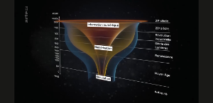

La République Sérénissime a dans ses archives *1000* ans d'histoire, soit près de *80* kilomètres de rayonnage. Des chercheurs ont entrepris de numériser ce fonds dans [le projet Venice Time Machine](https://vtm.epfl.ch/).

<!--more-->

C'est très intéressant car on ajoute une dimension temporelle à la Big Data : lorsque les archives auront été numérisées, on pourra faire des recherches (au sens de Google) dans le temps.

Les chercheurs mettent en œuvre des techniques de pointe :

- *tomographie* : scans par rayons X en 3D de manière à numériser les ouvrages en une passe sans même les ouvrir.
- *intelligence artificielle* : pour faire une première passe dans les archives et trier automatiquement les données.

Arte a diffusé [une série de reportages fort intéressants](https://www.arte.tv/fr/videos/075631-001-A/histoire-et-big-data-venice-time-machine-1-8/) sur ce projets que je recommande chaudement.

*Enjoy!*
