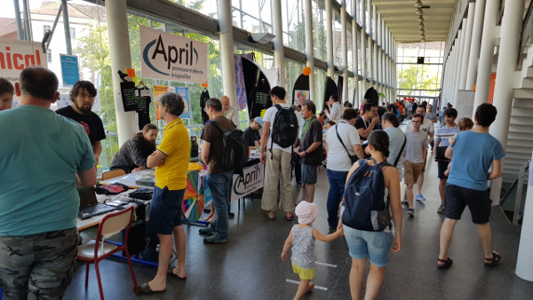

J'ai fait deux présentations aux [Rencontres Mondiales du Logiciel Libre 2018](https://2018.rmll.info/), voici les liens vers les slides.

<!--more-->

- L'ordinateur Quantique : <http://sweetohm.net/slides/ordinateur-quantique/>
- L'outil de build NeON : <http://sweetohm.net/slides/slides-neon/>

L'organisation était parfaite et l'ambiance très sympathique, bière et merguez, tout à fait dans l'esprit festif Open Source. A faire donc si vous avez l'occasion d'y aller.

*Enjoy!*
