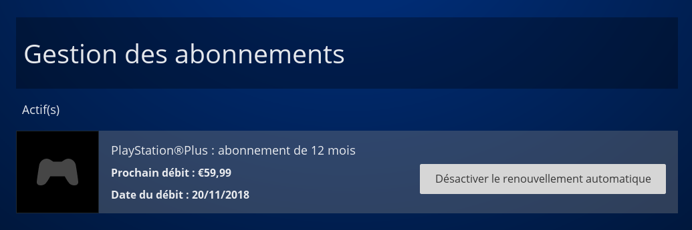
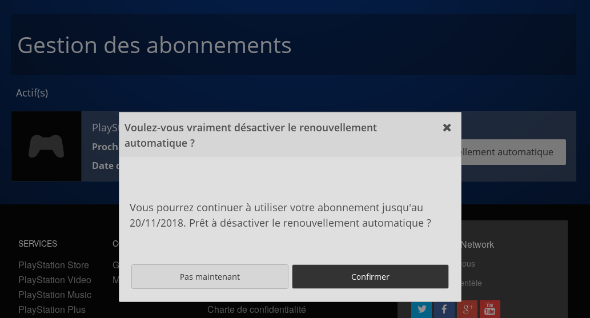
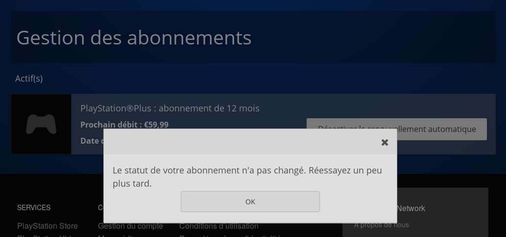

Voici des captures d'écran de ma tentative d'annuler le renouvellement automatique de mon abonnement au PSN :

<!--more-->

Il y a des bugs qui arrangent étrangement les entreprises qui les produisent... J'ai trouvé la solution : j'ai enlevé les références de ma carte bancaire de leur système de paiement, et je ne suis pas près de leur redonner !

*Enjoy!*
