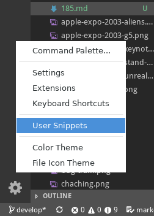
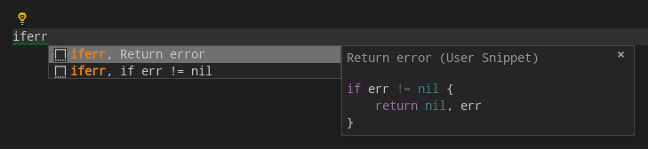

Mon [dernier poste](/blog/184.html) pointait un problème du langage de programmation Go : la nécessité d'écrire du code très redondant pour la gestion des erreurs. Je me suis donc posé la question de la résolution de ce problème et voici ma solution.

<!--more-->

J'utilise VScode (ou plutôt sa version réellement Open Source [VScodium](https://github.com/VSCodium/vscodium)) et j'ai donc écrit un template de code pour générer ce code de gestion des erreurs.

- Cliquer sur l'icône des préférences (en forme de molette en bas à gauche de l'éditeur) et sélectionner **User Snippets**.



- Sélectionner *go.json* et dans l'éditeur qui s'ouvre, taper le texte :

```js
{
	"Return error": {
		"prefix": "iferr",
		"body": [
			"if err != nil {",
			"\treturn $2err",
			"}"
		],
		"description": "Write Go code for error management"
	}
}
```

Enregistrez, et maintenant quand vous tapez *iferr*, vous avez la possibilité de générer automatiquement le code de gestion des erreurs :



Je vous invite à modifier cet exemple pour l'adapter à vos besoins.

*Enjoy!*
