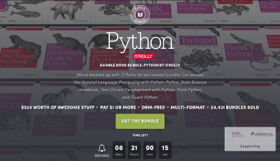

O'Reilly propose un [humble bundle Python](https://www.humblebundle.com/books/python-oreilly-books) : vous donnez ce que vous voulez (à partir de 1 $) pour un bundle d'ouvrages O'Reilly qui vaut jusqu'à *524 $* (selon le montant payé), sans DRM et en multi-format (souvent ePub et PDF) !

<!--more-->

Les bénéfices de cette vente iront à [Code for America](https://www.codeforamerica.org/) et la [Python Software Foundation](https://www.python.org/psf/), donc en plus de faire une bonne affaire, on fait une bonne action !

*Enjoy!*
