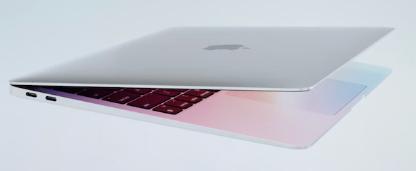

Lors de leur dernière conférence, le 10 novembre 2020, Apple a présenté leurs nouvelles machines à base de leurs propres processeurs M1 basés sur une architecture ARM. Cela a éveillé mon intérêt car ils annonçaient des performances bien meilleures que leurs précédentes machines à base de processeur Intel. Je me suis demandé dans quelle mesure on pouvait accordé foi à cette présentation marketing.

<!--more-->

Néanmoins, cette présentation a provoqué en moi une cascade de réflexions sur l'avenir des ordinateurs personnels. Cela faisait des années que les téléphones mobiles et tablettes utilisent des SOC (System On Chip) ARM pour leur faible consommation électrique. Mais leur puissance n'a cessé de croître jusqu'à rivaliser avec celle des ordinateurs portables.

Il était donc logique que l'on pense a produire des ordinateurs portables à base de processeur ARM. Microsoft l'a fait avec son portable convertible Surface Pro X mais cela a été un semi échec parce que les performances de leur machine sont faibles et la logithèque compatible Windows ARM est inexistante.

J'étais donc assez sceptique.

## La sanction de la réalité

Ma moitié voulant acheter un Mac, je lui ai conseillé d'attendre la sortie des nouvelles machines le 17 novembre. Le jour même, étaient publiés des tests élogieux qui confirmaient les prétentions d'Apple : les processeurs sont environ trois fois plus rapides avec une autonomie double de celle des machines Intel.

Nous avons donc commandé un Macbook Air M1 le 18 novembre et j'ai eu l'occasion de le tester dés le lendemain.

Je dois dire que j'ai été conquis : cette machine est effectivement très puissante alors que sont autonomie est bien supérieure à tous les ordinateurs portables que j'ai pu tester.

Cela faisait bien longtemps que je n'avais vu un tel gouffre de performances entre deux générations d'ordinateurs. On a généralement un gain de quelques pourcents. La dernière fois que j'avais connu cela c'était en 1994 lorsque je suis passé d'une machine Intel 386 à un Pentium 90.

En moi a commencé à germer l'idée de changer de machine pour ce nouveau Mac. En tant que développeur Unix backend, il me manque encore un certain nombre d'outils pour pouvoir travailler avec cette machine.

Mais cette nouvelle architecture est tellement révolutionnaire que j'ai fait le pari que les outils qui me sont nécessaires seraient portés rapidement et j'ai commandé ma machine le 23 novembre.

## La migration

Comme lors de leur dernière migration de l'architecture PowerPC vers Intel, Apple a développé un outil Rosetta 2 qui permet de faire tourner les applications Intel avec le processeur ARM M1.

Cela fonctionne très bien, avec des performances tout à fait acceptables et permet de travailler en attendant les portages vers l'architecture Apple Silicon.

Les portages ses sont succédé à un rythme effréné :

- [Docker](https://www.docker.com/blog/apple-silicon-m1-chips-and-docker/) le *16 / 11*
- [Chrome](https://www.01net.com/actualites/google-chrome-87-gagne-en-fluidite-consomme-moins-d-energie-et-supporte-les-mac-m1-2007271.html) le *18 / 11*
- [Python](https://www.hebergementwebs.com/apple/la-premiere-version-native-de-python-pour-les-appareils-apple-m1-est-lancee) le *08 / 12*
- [Go](https://blog.golang.org/ports) le *17 / 12*
- [Parallels](https://www.parallels.com/blogs/parallels-desktop-apple-silicon-mac/) le *17 / 12*

Bien sûr, la plupart de ces portages sont encore en version béta, mais de mon expérience elles sont tout à fait utilisables.

Je ferai un point sur l'avancée des portages dans de prochains postes sur mon blog.

## Au delà des performances

Au delà de simples améliorations de performances et de l'autonomie, cette nouvelle architecture remet en question l'écosystème des ordinateurs personnels. On peut penser au premier abord que la situation est semblable à celle de la dernière migration d'Apple, mais il n'en est rien. Lors de la dernière migration, Apple perdait sa spécificité pour rentrer dans le rang avec l'architecture Intel. À part quelques fan boys Motorola, cela n'affectait pas grand monde : Apple avait le même fournisseur que les autres fabricants de PC.

La situation est maintenant totalement différente : Apple ne se fournit pas chez ARM, qui ne produit pas de processeurs par lui même. Apple réalise ses propres System On Chip ou SOC, qui regroupent les cœurs du CPU, les cœurs du GPU, les cœurs du Neural Engine, la mémoire vive et d'autres composants spécifiques. D'autres fabricants ne peuvent donc pas produire d'ordinateurs avec cette même puce M1.

Apple a les moyens de concevoir ses propres SOC et en a surtout l'expérience : ils travaillent à la conception de puce ARM depuis leur premier iPhone. Au fil des générations, ils ont peaufiné leur architecture jusqu'au A14 qui équipe leur dernier iPhone.

Du coup, la question se pose de savoir si les fabricants de PCs auront les moyens de produire leurs propres processeurs ARM. Microsoft lui même s'est contenté d'un processeur ARM générique, réalisé par Qualcomm sur la base du 8cx. Et ses performances n'égalent pas celles d'une puce Intel.

On peut légitimement de poser la question de la légitimité de l'architecture PC Windows. Pendant longtemps on vivait avec le souvenir d'un standard développé par IBM. Mais IBM s'est retiré du monde PC et Microsoft n'a pas vraiment de légitimité pour le hardware. Le capitaine du bateau PC était Intel pour le côté hardware. Si Intel est retiré de l'équation, qui pourra assumer son rôle ?

Je ne cacherai pas que tourner la page PC/Windows me réjouit, comme un formidable coup de pied dans la fourmilière (mais j'aime beaucoup ces petits animaux et ne donnerais pas de coup de pied dans leurs formidables constructions dans la vraie vie :o)

*Enjoy!*
