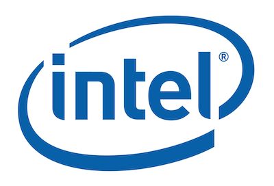

Le fond d'investissement *Third Point LLC* a sommé Intel, dans une lettre ouverte, de prendre des mesures pour réagir à la migration de nombre de ses clients vers des solutions alternatives basées sur ARM en particulier.

<!--more-->

Faut-il y voir une conséquence directe de la migration d'Apple vers des puces de sa propre conception ? La collision calendaire pourrait le laisser supposer...

[Article en anglais ici](https://www.macrumors.com/2020/12/30/intel-urged-to-take-immediate-action-amid-threats/amp/).

*Enjoy!*
