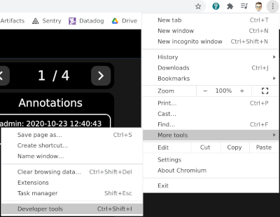
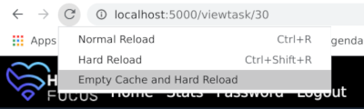

Lorsqu'on développe le front d'une application web, il faut souvent recharger le site en faisant le ménage dans le cache du navigateur.

<!--more-->

Il existe une fonctionnalité de Chrome qui est très utile dans cette situation : une entrée d'un menu qui permet de recharger la page et nettoyer le cache du navigateur.

Pour ce faire, il faut commencer par ouvrir les outils du développeur :

Puis faire un clic droit sur l'icône de rechargement de la page :

Le navigateur va alors recharger la page après avoir nettoyé son cache.

*Enjoy!*
