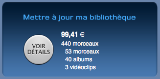

Apple propose maintenant de la musique sans DRM (pour le catalogue EMI seulement). Excellente initiative, mais le prix des morceaux est passé à 1,29 euro contre 0,99 euro pour les moceaux protégés.

<!--more-->

Les albums sont quant à eux au même prix. De plus, l'encodage des morceaux est de meilleure qualité (256 kbits/s contre 128). J'ai donc été agéablement surpris lorsque j'ai découvert cette nouvelle politique.

Jusqu'au moment où j'ai vu leur offre de mise à jour :

Je dois dire que je suis passablement déçu ! Que l'on me demande 0,30 euro pour mettre à jour les morceaux achetés individuellement, passe encore, mais que l'on me demande 30% du prix d'un album qui est vendu au même prix, je trouve cela pas très fair play. Apple a une façon très particulière de remercier ses plus fidèles clients...
