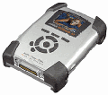

Ce week end, j'ai craqué pour l'Archos Multimedia Jukebox 20 Go... Je dévoile ici mes premières impressions et la procédure à suivre pour l'utiliser sous Linux (avec une Debian Woody).

<!--more-->

Tout d'abord, il ne faut pas croire les vendeurs de la FNAC, aimables mais pas toujours au courant : il est parfaitement reconnu par MacOSX (en version 10.2.2 pour ma part) et sous Linux.

La bête est à peine plus grande qu'un iPod (pour lequel je comptais craquer), mais il présente de nombreuses fonctionalités intéressantes : il peut lire et enregistrer des MP3, JPG et AVI (codec DivX ?) mais permet aussi d'enregistrer toute donnée. Il est livré avec une extension caméra. On peut donc s'en servir comme lecteur et enregistreur de MP3, comme visualisateur de photos et vidéos ou encore (avec l'extension) comme appareil photo/vidéo. On peut aussi s'en servir pour échanger des données entre ordinateurs.

En ce qui concerne la lecture, les MP3 passent bien, les images sont belles et les vidéos rendent étonnament bien sur un si petit écran (mais est-il possible de voir un film entier sans devenir aveugle ?). Le seul problème semble être dû à la jungle des encodages qui rend la lecture de DivX hasardeuse.

Pour ce qui est de la prise de son, d'images et de vidéos, le bilan est moins brillant (c'est le cas de le dire) : les images et vidéos sont d'une qualité très médiocre en intérieur. Lorsque la lumière est bonne, la qualité est tout juste acceptable. Mais pouvait-on attendre des merveilles d'une caméra aussi minimaliste ? Pour ma part, cette qualité convient à mon utilisation (photos et vidéos de vacances). À noter que l'on peut voir ces documents sur un téléviseur avec un bête connecteur.

La connection à un Mac est triviale : il suffit de connecter les machines avec le connecteur USB et d'attendre quelques instants pour que le jukebox monte sur le bureau. La connexion à une machine Linux demande une recompilation du noyau (pour ajouter le support de l'USB et autres modules), voir le document à l'adresse [http://oncode.info/include/texts.php?sect=linux&text=archos6000](http://oncode.info/include/texts.php?sect=linux&text=archos6000). Rien de bien méchant donc.

Les performances sont très correctes en USB et l'on est pas loin du Mo par seconde annoncé (j'ai transféré 417 Mo en 6 minutes sous Linux et en 10 sous MacOSX). Autrement dit, le transfert de fichiers MP3 est très réalisable. On notera qu'un connecteur FireWire (ou USB 2) est disponible en option.

À mes yeux, le seul vrai défaut de la bête me semble être l'hergonomie. La navigation dans le système de fichier est peu commode et il n'est pas possible de déplacer des fichiers entre répertoires (on peut cependant le faire sous MacOS ou Linux avec un le gestionnaire de fichiers).

Je suis donc enthousiasmé par cet appareil mais demande à voir la fiabilité sur le long terme pour m'en faire une opinion définitive.

