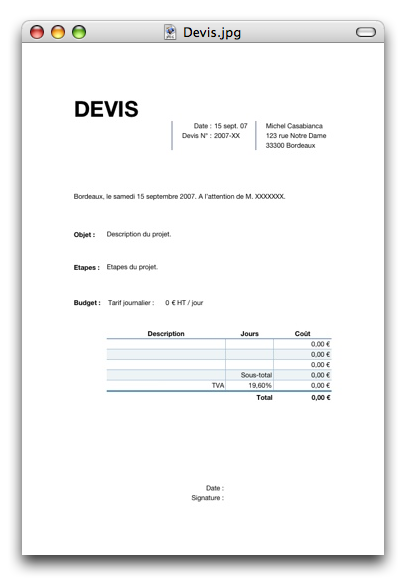

Commençant mon activité de Freelance, j'ai dû écrire mon modèle pour un devis. Bien évidemment, j'ai utilisé Numbers (le nouveau tableur Made in Apple). Voici le résultat de mes cogitations.

<!--more-->

Je suis parti du modèle Apple pour une facture que j'ai modifié pour arriver à ça :

Vous pouvez [télécharger ce modèle à cette adresse](http://www.sweetohm.net/arc/Devis.zip). Vous devriez compléter ce modèle avec les informations vous concernant (nom, adresse, etc) et l'enregistrer en tant que modèle avec Fichier/Enregistrer comme modèle... Choisir l'emplacement par défaut de manière à ce que ce modèle apparaisse dans la liste des modèles proposés lors de la création d'un nouveau document.

J'espère avoir le temps pour publier mon modèle de facture (qui ne devrait pas tarder logiquement).

Enjoy!
