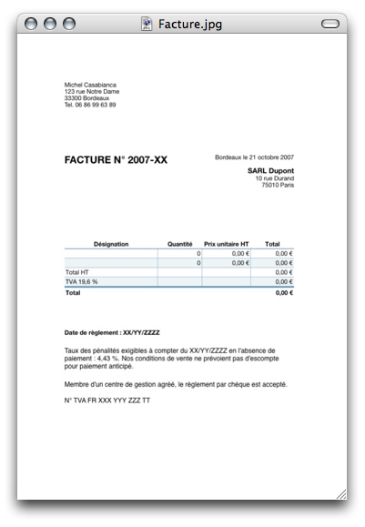

Dans la famille des modèles avec Numbers, voici maintenant la facture. Je me suis inspiré du modèle de facture Apple et ai suivi à la lettre les recommandations du site de l'APCE pour l'établissement d'une facture. Voici ce que cela donne :

Vous pouvez [télécharger ce modèle à cette adresse](http://www.sweetohm.net/arc/Facture.zip). Comme pour le devis, vous devriez le personnaliser et l'enregistrer en tant que modèle avec Fichier/Enregistrer comme modèle... Choisir l'emplacement par défaut de manière à ce que ce modèle apparaisse dans la liste des modèles proposés lors de la création d'un nouveau document.

Enjoy!

