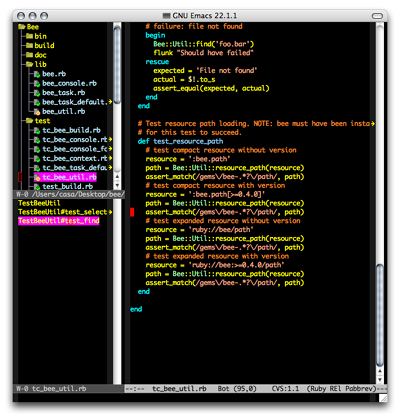

Je viens de découvrir [Emacs Code Browser](http://ecb.sourceforge.net/) (ou ECB). C'est comme une speedbar qui serait dans la même fenêtre et qui proposerait en plus une liste des classes et méthodes du source en cours d'édition et plein d'autres choses intéressantes.

Dans la capture d'écran ci-dessous, on voit un source Ruby, un arbre des fichiers dans la barre ECB à gauche ainsi que la liste des fonctions du source en dessous :



J'ai installé ECB sur un Emacs 22.1.1 et tout se passe à merveille. J'ai ajouté les lignes suivantes à mon fichier de configuration .emacs :

```
; configure ECB and activate if not in terminal
(require 'ecb)
(custom-set-variables
  '(ecb-compile-window-width (quote edit-window))
  '(ecb-layout-name "left15")
  '(ecb-primary-secondary-mouse-buttons (quote mouse-1--mouse-2))
  '(ecb-tip-of-the-day nil)
  '(ecb-tree-buffer-style (quote image)))
(if (not (eq window-system nil))
  (ecb-activate))
(defun ecb-off ()
  (interactive)
  ()
  (ecb-deactivate)
  (set-screen-width 80))
(defun ecb-on ()
  (interactive)
  ()
  (set-screen-width 119)
 (ecb-activate))
```

ECB, Semantic, EIEIO et Speedbar doivent être dans votre loadpath. Cette configuration donne au buffer de compilation la même largeur que le buffer d'édition, sélectionne le layout présenté dans la capture d'écran, rétablit une configuration rationnelle pour la souris dans la barre ECB (la configuration par défaut est totalement psychédélique), élimine le tip of the day horripilant et choisit le style graphique pour l'arbre des fichiers. De plus, celle active ECB en mode graphique (et non dans le terminal) et définit deux fonctions pour activer et désactiver ECB en redimensionnant la fenêtre.

Pour finir, [voici une archive](http://sweetohm.net/arc/ecb-2.32.zip) qui inclut ECB ainsi que EIEIO, Semantic et Speedbar dans des versions compatibles.

Enjoy!

