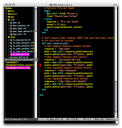

GNU ne distribue pas de binaires pour Emacs, sauf pour Windows. Voici des scripts pour compiler Emacs sur MacOSX. Le premier compile la version 22.1 (la première release officielle supportant MacOSX) :

```bash
#!/bin/sh
# Build Emacs 22.1 on MacOS
BUILD_DIR=~/Desktop
EMACS_VERSION=22.1
EMACS_DIR=emacs-$EMACS_VERSION
EMACS_ARCHIVE=$EMACS_DIR.tar.gz
cd $BUILD_DIR
curl http://ftp.gnu.org/gnu/emacs/$EMACS_ARCHIVE -o $EMACS_ARCHIVE
tar zxf $EMACS_ARCHIVE
rm $EMACS_ARCHIVE
cd $EMACS_DIR/mac
./make-package --self-contained
mv EmacsInstaller.dmg $BUILD_DIR
cd $BUILD_DIR
rm -rf $EMACS_DIR
```

Ce script télécharge l'archive du site de GNU, la décompresse, compile l’installeur pour MacOSX et fait le ménage à la fin. Il vous reste l'installeur sur le bureau, prêt à être installé.

Le deuxième script compile la version du repository CVS, pour les plus téméraires d'entre vous :

```bash
#!/bin/sh
# Build Emacs from CVS repository on MacOSXBUILD_DIR=~/Desktop
export CVS_RSH="ssh"
cd $BUILD_DIR
cvs -z3 -d:pserver:anonymous@cvs.sv.gnu.org:/sources/emacs co emacs
cd emacs/mac
./make-package --self-contained
mv EmacsInstaller.dmg $BUILD_DIR
cd $BUILD_DIR
rm -rf emacs
```

Ces scipts sont [dans l'archive ici](http://www.sweetohm.net/arc/build-emacs.zip). Le plus simple est de placer ces scripts quelque part dans votre PATH, et de taper `build-emacs` ou bien `build-emacs-22.1` dans un terminal. 

*Enjoy!*
