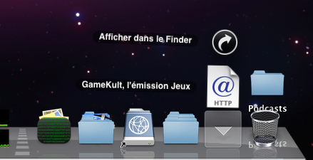

J'utilise iTunes pour gérer mes podcasts, mais je regrette qu'il ne dispose pas de la possibilité de les visionner en flux (sans avoir à les télécharger sur son disque).

<!--more-->

En effet, par défaut, il faut s'abonner à un podcast puis télécharger les épisodes pour les visionner. Cela est parfait si l'on souhaite les envoyer vers un iPod, mais c'est fastidieux si on veut les voir dans iTunes. Il faut attendre de les avoir téléchargés pour les visionner et il faut ensuite faire le ménage.

L'astuce présentée ici consiste à les voir en flux sous Leopard. Voici les étapes pour y parvenir :

 **Créer un répertoire pour ses podcasts**

On créera ce répertoire sur son bureau par exemple (c'est le cas dans mes captures d'écran).

 **Créer un raccourci dans le dock**

On crée un raccourci vers ce répertoire dans le dock avec un drag & drop.

 **Liens vers les podcasts dans ce répertoire**

Rechercher les podcasts désirés dans iTunes Store. Lorsqu'on drag & drop l'illustration du podcast, on peut obtenir un lien vers la page du podcast dans iTunes Store. Placer les liens dans le répertoire des podcasts créé précédemment.

Maintenant, lorsqu'on clique sur le répertoire dans le doc, il surgit la liste des podcasts :

Lorsqu'on clique sur un podcast de cette liste, iTunes s'ouvre et affiche la page du podcast. Il ne reste plus qu'à cliquer sur l'épisode désiré pour le visionner en flux.

Bons podcasts !
