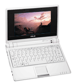

Asus sort un PC ultra portable à 300 euros. Pour ce prix, on a droit à un écran 7" (soit 17,78 cm et 800 × 480), un processeur Intel Celeron M 900 MHz, 512 Mo de RAM, mémoire de masse flash de 4 Go, Wifi 802.11b/g, Webcam, 3 connecteurs USB et un Ethernet. Tout cela dans 225 × 165 × 21-35 mm, 920 grammes et pendant 3h30 !

Cela m'a fait penser à [l'ordinateur à 100 $](http://www.laptop.org/index.fr.html) (qui est passé à 200 $ entre temps) pour les enfants des pays en voie de développement. Ces machines sont comparables, mais le système l'est tout autant : l'EEEPC est animé par un système Linux (distribution Xandros) et est fourni avec nombre de logiciels libres, tels que Firefox ou OpenOffice.

Une excellente initiative donc pour les enfants (même grands, du genre de ceux qui recompilent un kernel pour un oui ou pour un non ;o) à qui l'on aura épargné un système Windows. Heureuse génération !

Deux liens pour s'informer :

- [Le site du fabriquant Asus](http://eeepc.asus.com/fr/index.htm).
- [Un site de passionnés de l'EEEPC](http://www.eee-pc.fr/).

