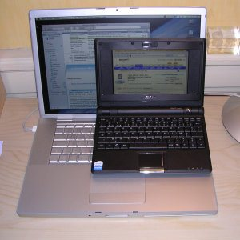
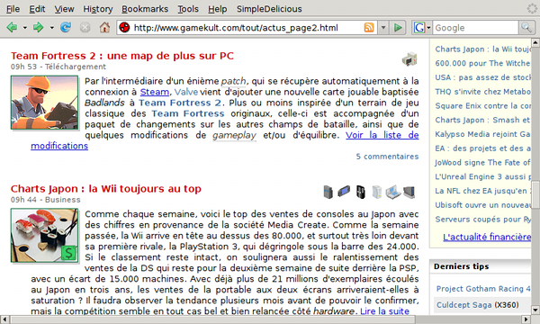
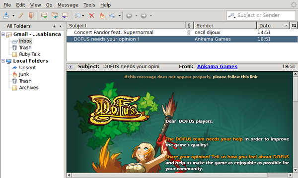
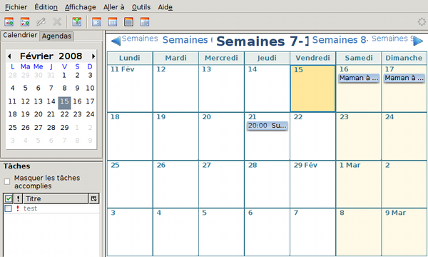
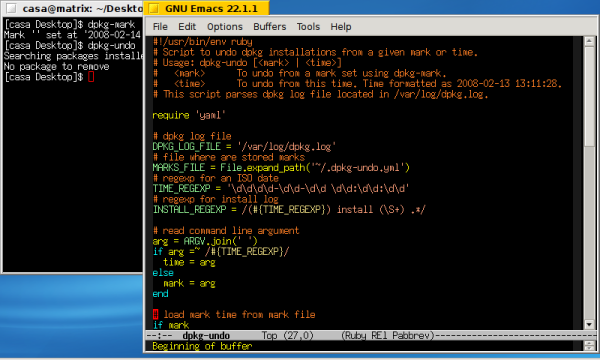

Comme tous ceux qui me connaissent s'en doutaient, je n'ai pu résister à l'appel de cette machine ! Je l'ai trouvée lundi après quelques coups de fil (chez Cybertech du Lac, il leur reste des modèles noirs à 299 €, pour ceux qui chercheraient sur Bordeaux). Je vous livre ici mes premières impressions.

Ce qui m'a marqué au déballage, c'est la qualité de la finition de la bête. Pour ce prix, je m'attendait à une machine avec une finition à la Fisher Price ;o) Il n'en est rien, la coque à l'air solide, l'écran est de belle qualité et il y a même une pochette et un velcro pour le cordon d'alimentation.

Ce qui marque ensuite, c'est la petitte taille de la machine, qui tient dans la main comme un bouquin de la pléïade. Voici une photo avec un MacBook Pro 15" pour comparaison :

Lorsqu'on revient à l'écran du Mac, on a une impression de gigantisme !

D'autre part, niveau hardware, il y a tout ce qu'il faut : trackpad avec scroll vertical (lorsqu'on glisse le doigt sur son côté droit), webcam, haut-parleurs, micro, prise casque, modem, ethernet, wifi, 3 USB et port pour cartes SDHC (cartes SD d'une capacité étendue à 32 Go). La mémoire est de 512 Mo et le stockage de masse est une SD interne de 4 Go.

Pour ce qui est du logiciel, on a droit à une distribution Linux Xandros plutôt bien intégrée puisqu'elle gère tout le matériel. Les applications intégrées sont classiques. Le reproche qu'on pourrait lui faire est son côté enfantin, avec un bureau remplaçé par un lanceur d'applications à onglets, façon Palm.

J'ai joué un peu avec Xandros pour tester et j'ai vite installé une eeeXubuntu (Xubuntu adaptée au EeePC). L'installation s'est passée sans soucis, mais tout n'est pas pris en charge (en particulier la webcam et le micro interne) et mieux vaut s'être renseigné un peu avant de se lancer dans cette installation, dont je reparlerai dans un prochain article.

Maintenant que j'utilise cette machine depuis une semaine, je peu dire qu'elle est très utilisable, malgré la petite taille de son écran et des ressources mémoire, disque et CPU limitées. Il faut simplement prendre de bonnes habitudes :

- Ne pas lancer trop d'applications en même temps.
- Mettre les applications en mode plein écran (avec Alt-F11).
- Eviter les applis qui occupent trop de place à l'écran (comme Evolution par exemple).
- Réduire la taille des icônes des barres d'outil et enlever le texte.

Ceci fait, on peut travailler dans de bonnes conditions. Voici quelques captures d'écran où l'on pourra se faire une idée de ce que cela donne :

Firefox :

Thunderbird :

Sunbird :

Emacs & XTerm :

Tout cela est donc tout à fait utilisable. La seule limitation qui me semble insurmontable pour certains concerne la taille des touches : si vos doigts sont très gros, vous aurez du mal à utiliser le clavier.

Un bien bel ordinateur donc, à conseiller si :

- Vous souhaitez pouvoir emmener partout un ordinateur facile à transporter.
- Vous souhaitez un portable à un prix abordable.
- Vous voulez un ordinateur qui consomme peu (16 W).
- Vous voulez acheter un ordinateur pour vos enfants (mes filles l'adorent).
- A éviter pour la retouche d'image ou les travaux gourmands en CPU.

Pour finir, la [vidéo du test d'un concurrent sérieux](http://fr.youtube.com/watch?v=b9du5U6Nk4U) (non, ce n'est pas le Macbook Air ;o)

