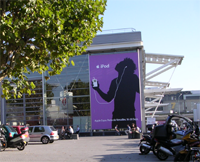

Je me suis rendu en début de semaine à la Mecques des adeptes de la pomme, je veux dire l'Apple Expo. J'y ai assisté à la grand messe (le keynote, au Palais des Congrès) et à quelques conférences fort intéressantes (sur l'Open Source chez les grands comptes ou encore le développement sur Mac OS X).

<!--more-->

**La keynote**

Steve Jobs est un génie de la communication, il monte ses shows comme des concerts de rock, avec jeu de lumière et tout. Cette keynote n'était certainement pas la meilleure (il avait moins à annoncer que lors de la WWDC dernière), mais nous avons tout de même appris que :

- Les PowerBooks ont été mis à jour (processeurs plus puissants et autres améliorations, nouveau 15").
- Claviers et souris bluetooth (c'est pourquoi tous les PowerBooks en sont maintenant équipés).
- Panther progresse mais n'est pas encore dispo (même pas en bêta distribuée sur le salon).

**Conférence sur l'Open Source chez les grands comptes**

Une conférence extrêmement intéressante sur les grands comptes et l'Open Source. Jean-Pierre Corniou (Directeur des Technologies et Systèmes d'information chez Renault) y a présenté l'utilisation de l'Open Source dans son entreprise, basée sur une évaluation des qualités intrinsèques et des coûts des solutions du monde du libre. Une approche qui me semble être la seule possible en entreprise où toute considération idéologique est non seulement déplacée, mais nocive à l'adoption du libre. Sa position à l'encontre des brevets (qui brident l'innovation selon lui) est très rassurante quand à l'attitude des grandes entreprises française par rapport à ce fléau.

**Conférence sur Xserve et Mac OS X Server**

Cette conférence présentait la solution server d'Apple. Elle venait à point nommé après la conférence sur l'Open Source, l'approche d'Apple en la matière est d'une simplicité lumineuse : ils se proposent, avec leur version serveur, de packager des logiciels libres (comme Apache, PHP ou MySQL) et de fournir une assistance (deux points faibles des logiciels libres). Ils essaient ainsi de garder le meilleur des deux mondes. Ils se visent les PME/PMI ayant un besoin de serveur pour le stockage de masse par exemple, ils ne prétendent pas attaquer le marché des gros serveurs.

**Conférence développeurs**

Cette conférence présentait l'architecture de Mac OS X, les outils de développement de Mac OS X, le webkit Safari et Java sur Mac OS X.

Des outils de développement, j'ai retenu qu'un effort a été fait en ce qui concerne les outils d'analyse de performance. On notera en particulier Shark, qui sera livré avec Panther. Il permet de mettre en évidence les bottlenecks dans le code et permet d'y remédier rapidement (par des conseils qu'il suffit d'implémenter).

Le conférencier a évoqué le process d'Apple pour contrôler les performance de Safari lors de son développement. Il préconise de se fixer des perfs à atteindre dés le début du développement et de considérer toute régression de perf comme un bug (à fixer comme tout autre bug). A opposer à l'idée généralement admise qui consiste à développer son appli sans se soucier des perfs et d'optimiser dans la dernière phase de développement. Cependant, lorsqu'on voit tourner Safari, cette méthode semble avoir porté ses fruits...

La démo du webkit Safari était assez bluffante : en quelques clics, il est possible d'inclure un browser web (qui n'est autre que Safari) dans ses propres applications. C'est rapide à coder et rapide au runtime.

La dernière partie traitait de Java sur Mac OS X. J'en ai retenu qu'Apple semble mettre les moyens pour n'avoir pas à rougir de sa VM.

**Démo WebObject**

J'ai eu droit à une petite démo de WebObject qui est un framework de développement d'applications web. On pourrait le comparer aux JSP munies de tags JSP. Une page comporte trois fichiers : la page HTML comportant des tags interprètés par le seveur, l'implémentation de ces tags (en Java) et une page qui fait le lien entre les deux dernières. A première vue, c'est du MVC plutôt propre, mais reste à voir ce que cela donne sur une grosse application.

