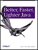

Je suis en train de relire [Better, Faster, Lighter Java](http://www.oreilly.com/catalog/bfljava/) pour les Editions O'Reilly. C'est un véritable calvaire : les chapitres n'arrivent pas assez vite ! A tel point que je ne peux m'empêcher de le lire en anglais. Ce bouquin est absoluement génial. Il remet les pendules à l'heure dans le monde Java et l'auteur n'hésite pas à écrire que les EJB sont un échec cuisant, que la communauté Java doit doit se débarrasser de ce boulet d'un autre âge. Son argumentation est sérieuse et bien documentée. Si les auteurs ne se contentaient que de cracher dans la soupe, le livre ne serait qu'un pamphlet. Il n'en est rien : ils présentent des solutions concrètes (et souvent issues du monde Open Source, ce qui ne gâche rien). A lire de toute urgence !

