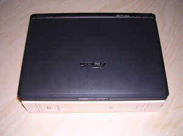
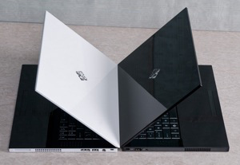

Le succès du EeePC d'Asus a été tellement foudroyant que l'on peut dire qu'il est à l'origine d'une nouvelle famille d'ordinateurs appelés [netbooks](http://fr.wikipedia.org/wiki/Netbook). A mon sens, ce n'est pas d'une nouvelle famille d'ordinateurs dont on devrait parler mais d'un nouveau [paradigme](http://fr.wikipedia.org/wiki/Paradigme). Voir dans l'EeePC le dernier gadget à la mode dont on se demandera vite à quoi il pourra bien servir sitôt après l'avoir acheté est très réducteur.

Pour comprendre pourquoi tant de gens se jettent dessus, il faut l'avoir eu en main. En main est bien le mot : il tient dans le creux de la main, comme un livre :

Comme un livre, on n'hésite pas à le prendre avec soi dans le bus, le glisser dans son sac en dernière minute à peine refermé. Avez-vous déjà envisagé d'acheter un sac particulier pour un livre ? Avez-vous déjà eu peur qu'on vous vole un livre ? Non, et bien pour un EeePC, c'est pareil : on ne se pose plus toutes ces questions que l'on se posait avec un portable plus encombrant et plus cher. J'ai eu l'occasion de l'emmener en voyage et c'est un vrai plaisir que je n'ai jamais eu avec un de mes Macs.

Bien sûr, il faut comparer ce qui est comparable : un EeePC n'a pas la puissance et le confort d'un MacBook Air (auquel il a souvent été comparé), mais pour lire des vidéos dans le train ou traduire un article le soir à l'hotel, c'est largement suffisant. D'autre part, il est clair que le premier modèle d'Asus, le 701, avec un écran de 7 pouces de diagonale, souffre de la taille de son écran. Cependant, les prochaines versions, 901 et 1000 d'une diagonale de 8,9 et 10 pouces devraient améliorer grandement les choses.

Mais l'important n'est pas là. Réduire le succès de l'EeePC à sa petite taille ou son prix modeste est encore très en dessous de la réalité. C'est un peu comme réduire le livre de poche à un livre de petite taille au prix abordable. Le netbook est un livre ouvert dans lequel s'engouffrent de nombreux fabriquants de portables bridés par l'équation maudite :

 **portable = intel + windows**

Ainsi, Asus a ouvert le feu en proposant son netbook avec un système Linux. Bien sûr, on a vu depuis longtemps des fabricants proposer des configurations livrées avec Linux préinstallé, mais souvent :

- Les mêmes machines étaient disponible avec Windows.
- Elles étaient au même prix (voire plus chères) que les versions Windows.
- Leur succès était mitigé.

Asus a lancé le EeePC avec Linux et sans Windows, mais en proposant les drivers Windows sur un DVD accompagnant la machine. C'est assez rare pour être souligné, mais cela a lancé un mouvement et la concurrence, nombreuse, y va de sa propre distribution Linux. Et certains ont de bonnes idées. De là à y voir un renouveau de Linux, il n'y a qu'un pas que je franchis allègrement et le coeur léger !

Autre tendance lourde amorcée par Asus : faire payer Windows ! Ils proposent en effet maintenant des versions avec Windows, mais font payer la différence de prix avec la version Linux. Ainsi l'utilisateur lambda va-t-il se rendre compte que Windows lui coûte (dans tous les sens du terme ;o)

Mais certains fabricants de portable vont encore plus loin et abandonnent les processeurs X86. Ainsi, le netbook [Bestlink Alpha 400](http://www.blogeee.net/2008/05/23/bestlink-alpha-400-180-le-netbook-si-vous-en-prenez-100/) est basé sur un processeur RISC XBurst d'Ingenic Semiconductors.

Ainsi, on assiste à une explosion de créativité qui me rappelle les débordements créatifs des années 80 où chaque semaine voyait naître son lots d'ordinateurs tous incompatibles au niveau matériel et logiciel. Darwin est passé par là et personne ne se souvient plus des Alice, Tandy, Commodore, Sinclair et autres, sans parler de ceux qui ont passé la décénnie, comme les Amiga ou Atari.

N'ont finalement survécus que les Mac et les PCs. Autant les Macs étaient plutôt bien lotis par mère nature, autant on se demande comment une machine comme le PC a pu survivre… Avec son BIOS et ses interruptions, ses 640 Ko de mémoire basse et Windows, ses lecteurs de disquette et sa consommation de 200 Watts !

Les nouveaux netbooks, et leurs déclinaisons de bureau (comme [la EeeBox](http://www.blogeee.net/2008/05/29/la-eeebox-passee-en-revue-chez-anandtech/)) consomment moins, sont moins chers, disposent de toutes les applications dont vous avez besoin, sont insensibles aux virus et aux spywares, utilisent un système d'exploitation moins cher et plus stable que chaque fabriquant peut adapter à son gré. De là à penser que les netbooks sont les chouchous de l'évolution…

A tous ceux qui me diront que les PCs ont gagné la course à l'évolution, tout en étant ce qui se fait de pire techniquement, je dirais que la course à l'évolution n'est jamais terminée et qu'il ne tient qu'à eux qu'elle se finisse bien !

 **P.S**: En visionnant [la vidéo de présentation du HP Voodoo Envy 133](http://www.engadget.com/2008/06/10/voodoo-floats-13-3-inch-envy-133-in-the-air/) (à 3 min 30 s du début) je me suis aperçu que certains constructeurs, comme HP, n'hésitent plus à embarquer Linux, en douce. Leur discours est un peu retors et cela donne à peu près : *"Non, non, nous ne voulons pas virer le Vista qui est dessus, mais si vous voulez aller plus vite pour browser le net ou lire vos mails, il y a Linux"*. A noter que la touche Windows a été remplacée (comme dans le cas du EeePC) par un logo personnalisé. Ceci dit, cette machine est superbe !

