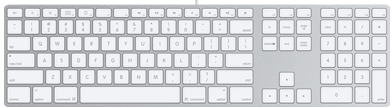

Je viens de craquer pour le dernier modèle de clavier Apple et je dois dire que je ne suis pas déçu !

<!--more-->

Enfin Apple s'est décidé à sortir un clavier digne de ses ordinateurs. J'avais acheté auparavent le clavier blanc sans fil de la génération précédente. Et il ne m'avais pas emballé : trop lourd, mauvaise sensation des touches, piles à recharger, etc.

J'avais donc fini par utiliser un clavier Dell (que j'utilise au travail), une valeur sûre. Mais utiliser un clavier PC sur un Mac, c'est loin d'être parfait : le mapping PC n'est pas géré, donc il faut connaître la clavier Mac par coeur et c'est lassant.

Ce clavier est donc quasiment parfait : les touches sont très plates, mais leur toucher est franc et la matière rugueuse de leur surface est très agréable. Seul reproche : une touche ENTER un peu petite. D'autre part, je n'ai pas compris comment on utilise les touches de fonction et les touches Apple en même temps. On a le choix de l'un ou l'autre mode dans le panneau de configuration du clavier, mais je suppose qu'il doit être possible d'utiliser les deux fonctions simultanément.

Pfffff, ce sera bien la première fois que je lirai le manuel d'utilisation d'un clavier ! Autre curiosité : une mise à jour du firmware de mon clavier a été installé par le système ! Je ne savais même pas qu'il y avait du code là dedans !

J'aime tellement ce clavier que je commence à envisager de m'en acheter un pour le travail ! Toujours est-il que je vous le recommande très chaudement.

La question est maintenant de savoir quand Apple renouvellera sa gamme de souris que je trouve aussi assez moyennes. Si elles sont d'aussi bonne qualité que le clavier, je suis preneur !
