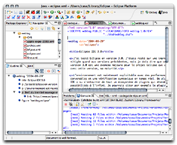

J'ai testé Eclipse en version 3.0. J'étais resté sur une impression mitigée quand aux versions précédentes, mais je dois dire que cette version 3.0 est une avancée majeure pour le projet Eclipse qui atteint, avec cette version, sa maturité.

L'environnement est maintenant exploitable avec des performances convenables et une vérification syntaxique en temps réel. De plus, cet IDE a su s'entourrer de tout un écosystème de plugins qui étendent ses possibilités à l'infini. Je pourrais citer par exemple le plugin oXygène (d'édition de documents XML) ou encore celui permettant l'intégration de Tomcat dans l'environnement de développement.

Bref, du bien bel ouvrage en Open Source à découvrir, ou redécouvrir, sur le [site du projet Eclipse](http://www.eclipse.org/).

