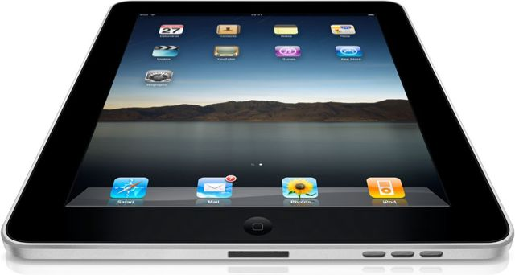

J'ai acheté un iPad vendredi, après l'avoir réservé à la FNAC la semaine précédente. 

<!--more-->

Pourquoi avoir acheté un iPad alors que j'ai (déjà) un iPhone ? Tout simplement parce que j'utilise énormément mon iPhone, bien plus maintenant que mon Mac, et que la perspective de disposer d'un écran d'une diagonale de 10 pouces était très séduisante. Je suis en effet de ceux qui pensent que l'iPad n'est qu'un gros iPhone, mais ce n'est pas une injure dans ma bouche, bien au contraire !

J'ai opté pour la version 64 Go, 3G. Vu que la machine n'est pas évolutive, mieux vaut voir grand pour n'avoir rien à regretter plus tard. D'autant que mon iPhone de 32 Go est déjà bien plein, et que quelques vidéos supplémentaires dans un iPad seront les bienvenues en voyage.

La première chose qui m'a marqué, c'est la qualité de l'écran. Les couleurs sont éclatantes et les images sont d'une grande finesse. On remarque aussi la qualité et l'élégance de la coque unibody en aluminium. Du beau matériel donc. On est ensuite frappé par la fluidité des animations de l'interface. L'iPhone était déjà assez fluide, mais là on atteint des sommets. On sent que le CPU en a sous le capot ! Côté hardware, la seule déception (toute relative) est la finition plastique des boutons qui font un peu cheap.

En ce qui concerne les applications, on n'est pas dépaysé lorsque l'on connait l'iPhone. Cependant, certaines applications profitent bien du mode paysage. C'est la cas de mail, du carnet d'adresses ou encore du bloc notes qui proposent un menu à gauche. C'est bien vu et ça exploite bien l'espace à l'écran. Par contre, certaines applications, comme la calculatrice, la météo ou encore la bourse ont disparu. J'ai cru comprendre qu'Apple ne les avait incluses car il n'avait pas encore réussi à les porter convenablement sur l'écran grand format.

En ce qui concerne les l'AppStore, je me suis bien sûr rué sur les applications qui font le buzz (Pages, Numbers et keynote), mais je n'est pas encore eu l'occasion de les utiliser suffisamment. Par contre, j'ai acheté et lu la version électronique de Wired et j'ai été conquis ! Ces types sont peut être en train d'inventer le futur ! Peut être l'aspect multimédia pourrait être poussé plus loin, mais c'est déjà très bluffant.

On peut regretter qu'il soit nécessaire d'activer l'iPad avec iTunes, et donc qu'un ordinateur soit indispensable. C'est d'autant plus regrettable qu'une cible potentielle de cette machine est le réfractaire à l'informatique. Typiquement, ma mère serait la cliente idéale. Pour qu'il puisse fonctionner seul, il faudrait aussi pouvoir effectuer des sauvegardes sur une clef USB un un disque dur externe.

On peut aussi regretter le manque d'ouverture d'Apple qui commence à faire peur à tout le monde avec sa manie de vouloir tout contrôler. Même les fans (dont je me revendique) commencent à être inquiets.

Au final, je ne regrette pas mon achat et suis aussi convaincu qu'après l'acquisition de mon iPhone. Je suis persuadé qu'il rencontrera un succès comparable, mais les parts de marché croissantes d'Androïde devraient faire réfléchir Steve sur les vertus de l'ouverture.

