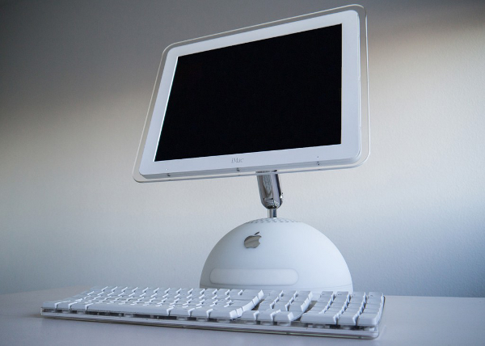
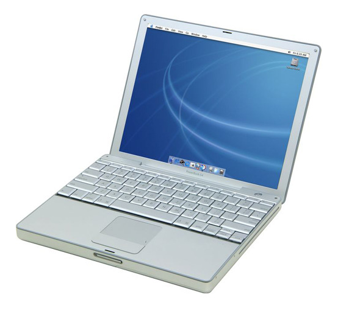
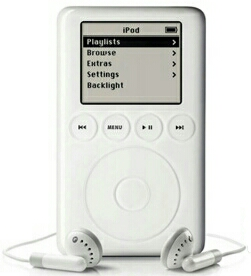
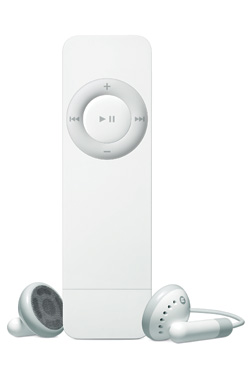
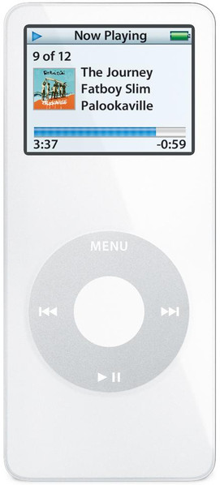

Cela fait maintenant plusieurs mois que je me suis débarrassé de mon dernier produit Apple, un MacBook Pro de 2007. C'est sans regrets, mais avec un peu de nostalgie, que je me souviens de mes années Apple...

<!--more-->

Tout a commençé pour moi en décembre 2002, [quand j'ai acheté un iMac G4 17"](4.html) :

C'était une machine extraordinaire ! Son design était très réussi : une demi-sphère surmontée d'un écran orientable en tous sens (grâce à un lest d'une masse hallucinate dans le pied), d'où sortait le lecteur DVD, comme une langue. L'écran plat de 17" était un luxe inouï pour l'époque et la connexion entre la machine et l'écran était entièrement numérique, une première. La légende voulait qu'Apple aie débauché des spécialistes des missiles intercontinentaux pour créer la carte mère ronde...

Les enceintes étaient d'une qualité incroyable, à des années lumières des enceintes bas de gamme qui équipent la plupart des PCs. Sur le clavier, il y avait deux connecteurs USB, bien pratiques pour brancher une souris ou une clef USB. Le tout était en plastique blanc laiteux et transparent vraiment classe. La qualité du tout était juste impossible à approcher avec un PC, quelqu'en soit le prix.

Niveau logiciel, le système MacOSX est basé sur un micro kernel Mach et les commandes BSD, le seul et vrai Unix diront les puristes. Sur cette base solide ils ont eu la bonne idée de coller une interface graphique, Quartz, très en avance sur son temps : les fenêtres et tout le bureau sont gérés par la carte 3D. D'autre part, Apple fournissait une suite de logiciels pour faire de cette machine un hub numérique : iPhoto (pour organiser sa photothèque) et iTunes (pour gérer sa musique). 

Avec une telle machine de bureau, on voit d'un autre oeil son portable PC moche. J'ai vite craqué pour un  PowerBook 12" :

Même constat pour cette machine : une qualité matérielle et logicielle incroyable. La coque était en aluminium de belle facture et sa silhouette était très minimaliste, sa connectique rationnelle. Le seul défaut de cette machine était son poids.

Ces deux machines ont été utilisées jusqu'en 2012, soit 10 ans de bons et loyaux services !

En 2007, j'ai acheté un MacBook Pro 15". Si le design de cette machine était réussi, bien que quasiment identique à celui du PowerBook, de quelques années son ainé, la qualité n'était plus au rendez-vous : 4 années plus tard, la carte mère décède et la facture à l'AppleStore a été plutôt salée, 450 € ! D'autre part, c'est avec cette machine qu'ont commencé les tracasseries hardware : vis non standard, donc tourne-vis spécial obligatoire pour ouvrir la machine... Par la suite, Apple nous a fait le coup des batteries collées et bien d'autres brimades pour que l'utilisateur passe à la caisse.

En 2002, je voulais acheter un iPod en même temps que mon Mac. Je me suis laissé convaincre par les caractéristiques techniques supérieures sur le papier et ai [acheté un Archos](/blog/3.html). Bien sûr c'était une erreur et j'ai vite revendu l'Archos pour acheter un iPod :

Il n'y avait aucune comoaraison possible avec l'Archos : l'ergonomie permettait d'écouter la musique dans de très bonnes conditions et la qualité audio était impeccable. Son seul défaut était une fragilité due au disque dur interne.

J'ai ensuite craqué pour l'iPod Shuffle dont j'ai trouvé le concept assez génial : un stick USB à accrocher autour du cou. On avait de la musique à portée d'oreilles toute la journée. Son défaut était une navigation à l'aveugle : il n'y avait pas d'écran et la meilleure utilisation était en mode shuffle (lecture aléatoire), d'où son nom.

Lorsqu'est sorti l'iPod nano, on avait le beurre et l'argent du beurre : un écran qui permettait une navigation aussi confortable qu'avec un iPod avec une petite taille. On pouvait aussi l'attacher autour du cou. C'était le graal ! J'ai gardé cet appareil très longtemps, jusqu'à ce que j'achète un iPhone.

Liens
-----

http://www.maximeraphael.fr/hi-tech/imac-g4-tournesol/
